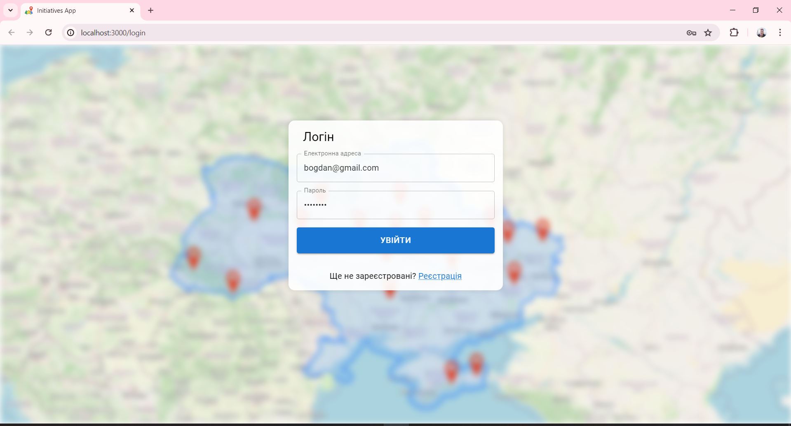
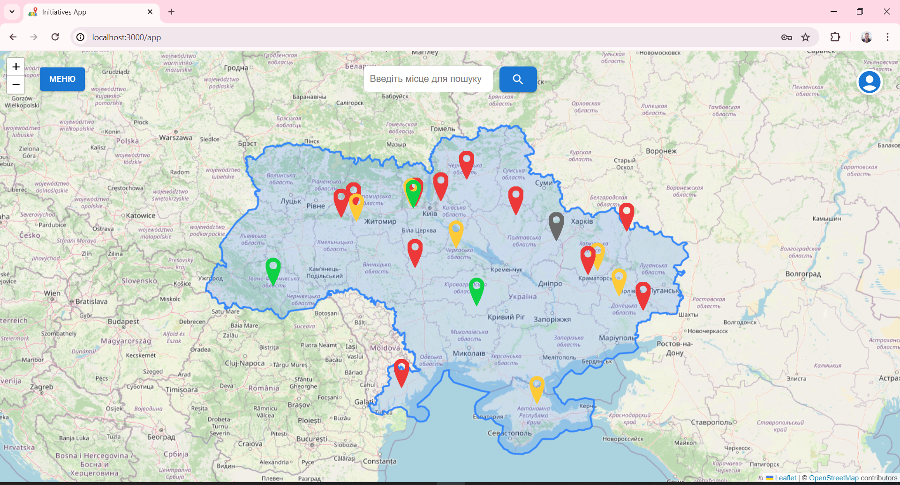
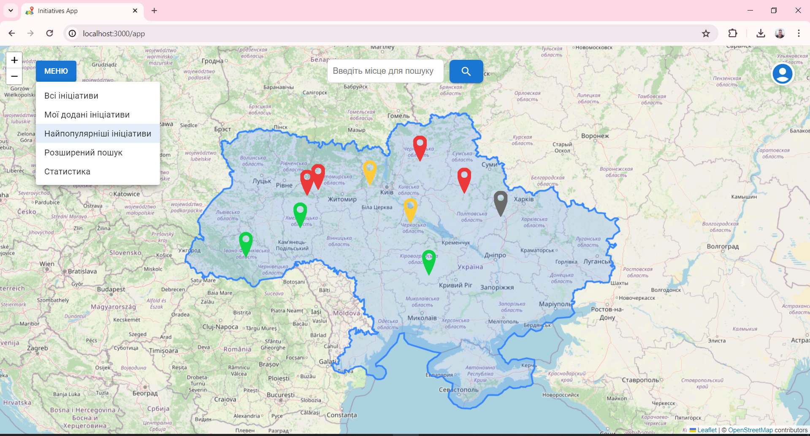
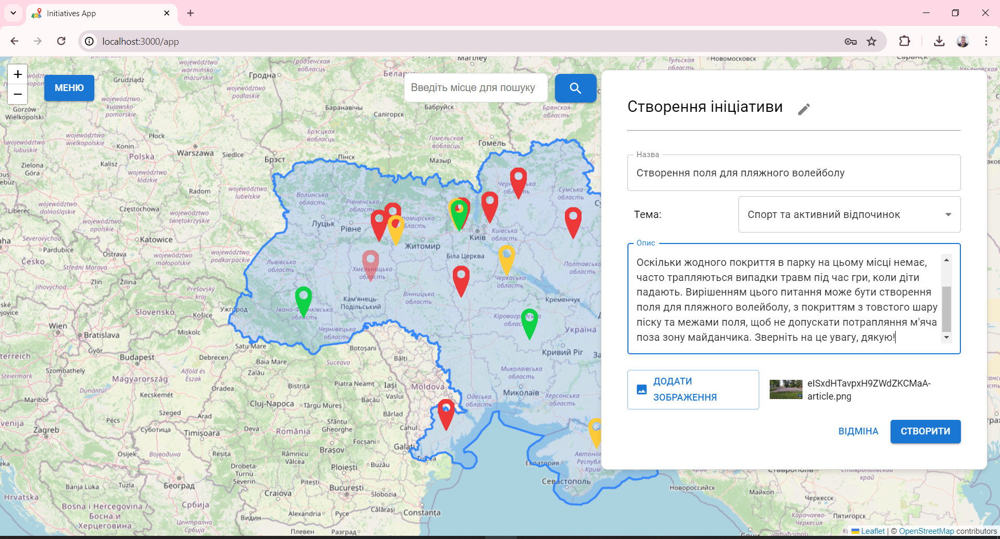
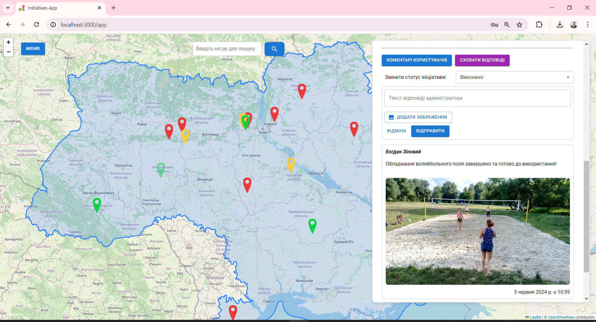
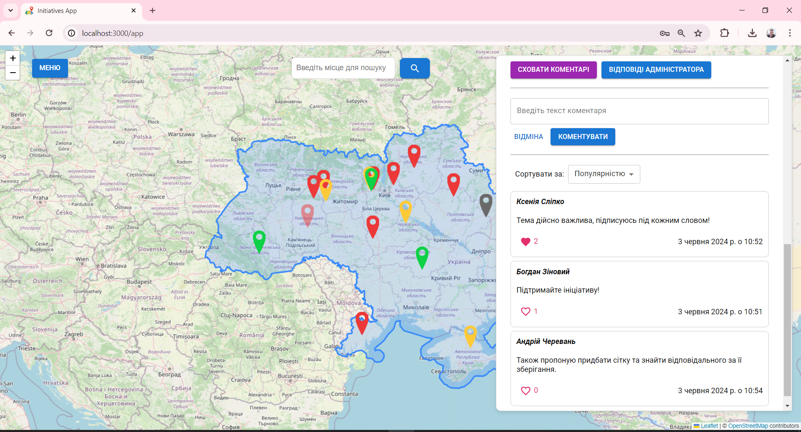
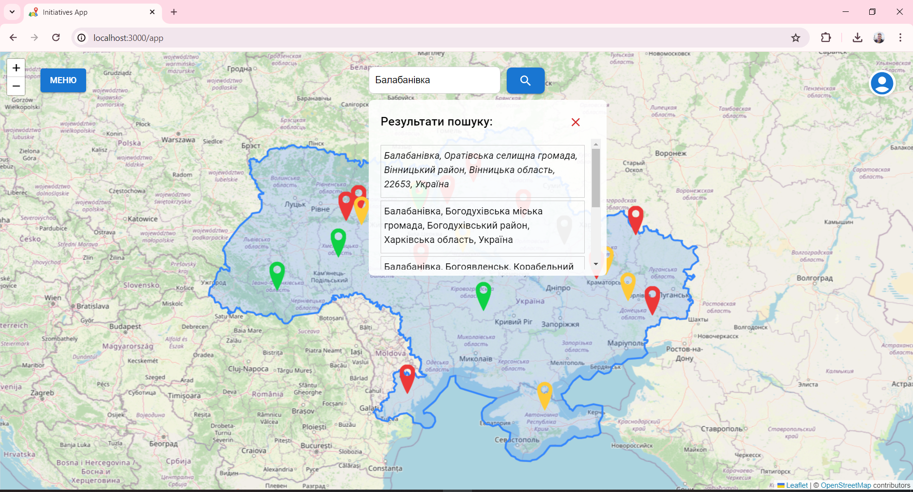
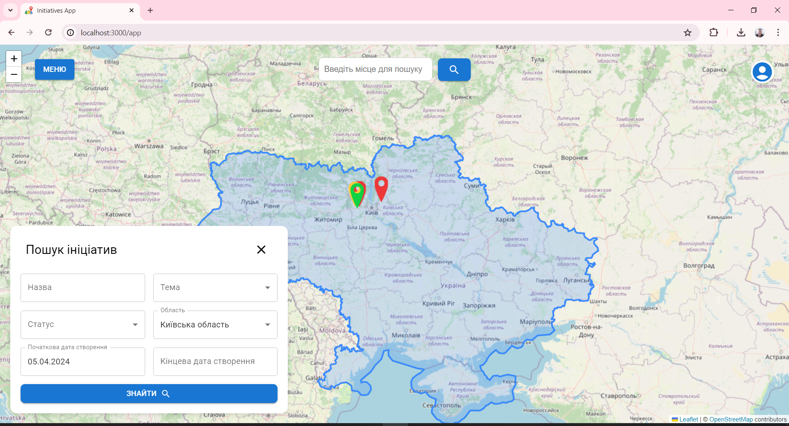
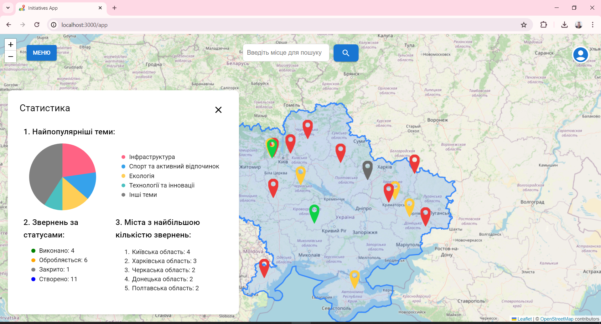

# Веб-застосунок для координації та агрегації громадських ініціатив

## Опис проєкту

Цей веб-застосунок створений для підтримки громадських ініціатив шляхом координації зусиль користувачів через інтерактивну карту.

Система дозволяє:

- Додавати ініціативи, прикріплюючи їх до географічної локації.
- Коментувати ініціативи інших користувачів.
- Відстежувати статус та прогрес виконання ініціатив.
- Переглядати статистику популярних тем та ініціатив.

### Технології

- **Клієнтська частина**: React.js, JavaScript, Leaflet, Material UI, Nominatim API.
- **Серверна частина**: NestJS, TypeScript, TypeORM, PostgreSQL, Azure Blob Storage, JWT.

---

## Інфраструктура

### Серверна частина

- **NestJS**: Фреймворк для створення серверної логіки.
- **TypeORM**: ORM для взаємодії з базою даних PostgreSQL.
- **PostgreSQL**: Реляційна база даних для збереження структурованих даних.
- **Azure Blob Storage**: Сховище для збереження зображень.
- **JWT**: Для авторизації користувачів.

### Клієнтська частина

- **React.js**: Для побудови SPA з компонентною архітектурою.
- **Leaflet**: Інтерактивна мапа.
- **Nominatim API**: Для геокодування адрес.
- **Material UI**: Стилізація інтерфейсу.

---

## Інструкція запуску

### Серверна частина

1. Перейдіть до каталогу `server`.
2. Встановіть залежності:
   ```bash
   npm install
   ```
3. Запустіть PostgreSQL:

```bash
docker-compose up -d
```

4. Створіть обліковий запис в Azure Blob Storage, додайте контейнер і отримайте параметри підключення:

```env
CDN URL: https://<назва-акаунту>.blob.core.windows.net/files
Container Name: files
Connection String:DefaultEndpointsProtocol=https;AccountName=<назва-акаунту>;AccountKey=<ключ>;EndpointSuffix=core.windows.net
```

5. Додайте ці дані до файлу .env у каталозі серверної частини:

```env
CDN=https://<назва-акаунту>.blob.core.windows.net/files
AZURE_BLOB_STORAGE_CONTAINER_NAME=files
AZURE_BLOB_STORAGE_CONNECTION_STRING=DefaultEndpointsProtocol=https;AccountName=<назва-акаунту>;AccountKey=<ключ>;EndpointSuffix=core.windows.net
```

6. Запустіть сервер:

```bash
npm start
```

Сервер буде доступний за адресою: http://localhost:8080

### Клієнтська частина

1. Перейдіть до каталогу client.
2. Встановіть залежності:
   ```bash
   npm install
   ```
3. Запустіть клієнт:

```
npm start
```

Клієнт буде доступний за адресою: http://localhost:3000

## Приклади використання застосунку:

1. **Логін**
   

2. **Головна сторінка**
   

3. **Меню**
   

4. **Додавання ініціативи**
   

5. **Перегляд ініціативи**
   

6. **Коментарі**
   

7. **Пошук місцевості**
   

8. **Пошук ініціативи**
   

9. **Статистика**
   
